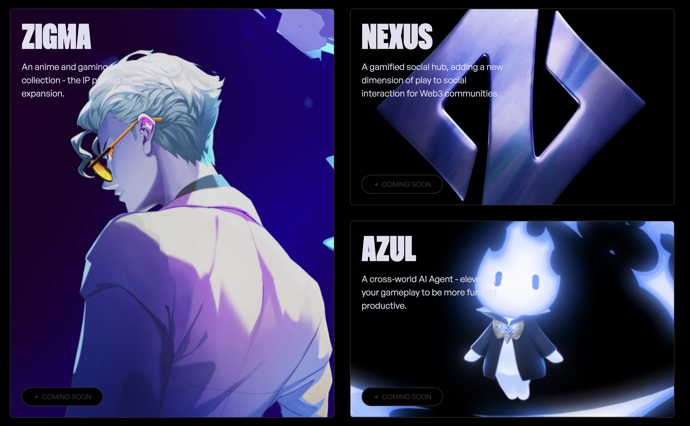

# 🎮✨ React Game-Inspired Landing Page  
**A motion-first experience built for impact**

> Built a visually striking, animation-driven landing page that blends bold motion design with a seamless user journey — delivering an immersive, high-energy experience.

---

## 🎬 Highlights
- 🎞️ **Smooth GSAP Animations** — timeline-based, scroll-triggered transitions  
- ⚛️ **React-Powered Components** — reusable and lightweight  
- 📱 **Fully Responsive** — designed to look great on every screen  
- 💡 **Modern Motion Design** — inspired by cinematic websites and interactive media  

---

## 🖼️ Preview
  
*Bold visuals. Fluid motion. Built for engagement.*

---

## 🛠️ Tech Stack
| Category | Tools |
|-----------|-------|
| **Library** | React |
| **Animation** | GSAP |
| **Styling** | CSS / Tailwind |
| **Build Tool** | Vite |
| **Deployment** | Vercel |

---